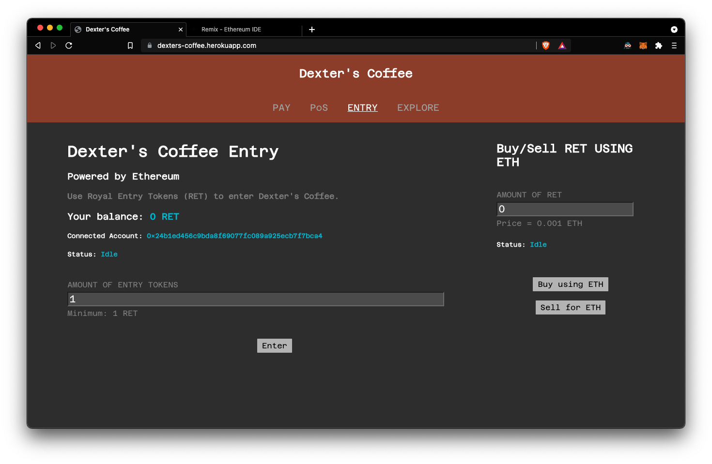

# Creating an Entry system for Dexter's Coffee using an ERC20 Token (RET)
As part of Assignment 3, we have created a token following the ERC20 standard that allows easy entry for customers of Dexter's Coffee. 

The token functionality has been integrated into our previous frontend and can be found at the web portal here: https://dexters-coffee.herokuapp.com under the **Entry** Section. 

**Note**: You must have the [MetaMask Extension](https://chrome.google.com/webstore/detail/metamask/nkbihfbeogaeaoehlefnkodbefgpgknn?hl=en) installed to buy and sell RET using ETH.

**Note**: The token has been deployed on the Ropsten Testnet. You can get fake ETH from a [faucet](https://faucet.dimensions.network) for testing purposes.

## Screenshot

## Website Usage Instructions
1. Visit https://dexters-coffee.herokuapp.com and click on the **Entry** section.
2. The MetaMask extension will open on its own and you must connect your ETH wallet to the website. Make sure to connect only one wallet to the website.
3. Your RET balance will show up in the left, if you have never bought RET before, it will show up as 0.
4. Buy RET using your ETH balance (obtained using a faucet) by entering the number of tokens you want to buy in the text field on the right and clicking the "Buy using ETH" function. Confirm on the MetaMask popup. After the transaction is confirmed, the balance will show up in the right.
4. You can now enter the Coffee Shop by putting in a value (>= 1) for number of entry tokens and clicking "Enter". This will send RET from your balance to the contract account.
5. To sell your RET for ETH, enter the number of RET you want to sell in the text field on the right and click on "Sell for ETH". After approval and transaction confirmation, the corresponding ETH will be sent to your connected wallet. 

## Test Transactions

**Note**: To show that the contract is rejecting incorrectly performed transactions, no validation is being done on the frontend, the errors can be seen on the transaction page on a blockchain explorer.

Contracts and transactions created can be viewed on a blockchain explorer like EtherScan. The contracts created and a few test transactions have been liked below:

1. [Royal Entry Token](https://ropsten.etherscan.io/token/0xbeb27d331e35100987cdd27b536e230f74139910)
2. [Royal Entry Token (Contract)](https://ropsten.etherscan.io/address/0xbEB27d331e35100987cdD27B536E230f74139910)
3. [Royal Entry Token Sale (Contract)](https://ropsten.etherscan.io/address/0x22cf194B71bdb3FBc06d4DC602132B32E3815635)
4. [Successful Entry transaction](https://ropsten.etherscan.io/tx/0xe1c7a2c764ba6f50ca5e1c1521e989adec08564ff4369d57f9b98bea50e3c726)
5. [Unsuccessful Entry transaction (Exceeded balance)](https://ropsten.etherscan.io/tx/0x3e8c5c9efdc7840a7cc6800078ca97d861acd7ba8acc4c3207b0ab0dfc220555)
6. [Unsuccessful Entry transaction (Sent less than minimum amount)](https://ropsten.etherscan.io/tx/0x85a1f4f85d2ffb233e48d80197a87d01ff7261defd93749b5ca20b8e91f54586)
7. [Successful Buy using ETH](https://ropsten.etherscan.io/tx/0x24074346d598407ee1d2f910d5642fabdadc3395387ccf9f8cc06a633cf5f280)
8. [Successful Sell for ETH](https://ropsten.etherscan.io/tx/0x60deae136854fd38ac47b6eac3cbd2db7084e2aef49e34c5e634e56774ea9d7e)
9. [Unsuccessful Sell for ETH (Tried to sell more than balance)](https://ropsten.etherscan.io/tx/0xc77874ba918175aeccc252efbbaf414de28cd76bdac8a2ee302f86aeb370eef9)

## Contract files usage instructions
- In a JavaScript VM on Remix IDE, compile and deploy `RET.sol` passing initial supply as `1000000`.
- Copy the address of deployed instance, compile and run `RETsale.sol` by passing address of `RET.sol` instance as constructor parameter and value of coin as `1000000000000000` wei.
- Transfer 750,000 coins to the `RETsale.sol` contract account using the transfer function in `RET.sol`. These will be the coins available for sale.
- Next, you can test buying, selling and entering the shop functions in `RETsale.sol`.